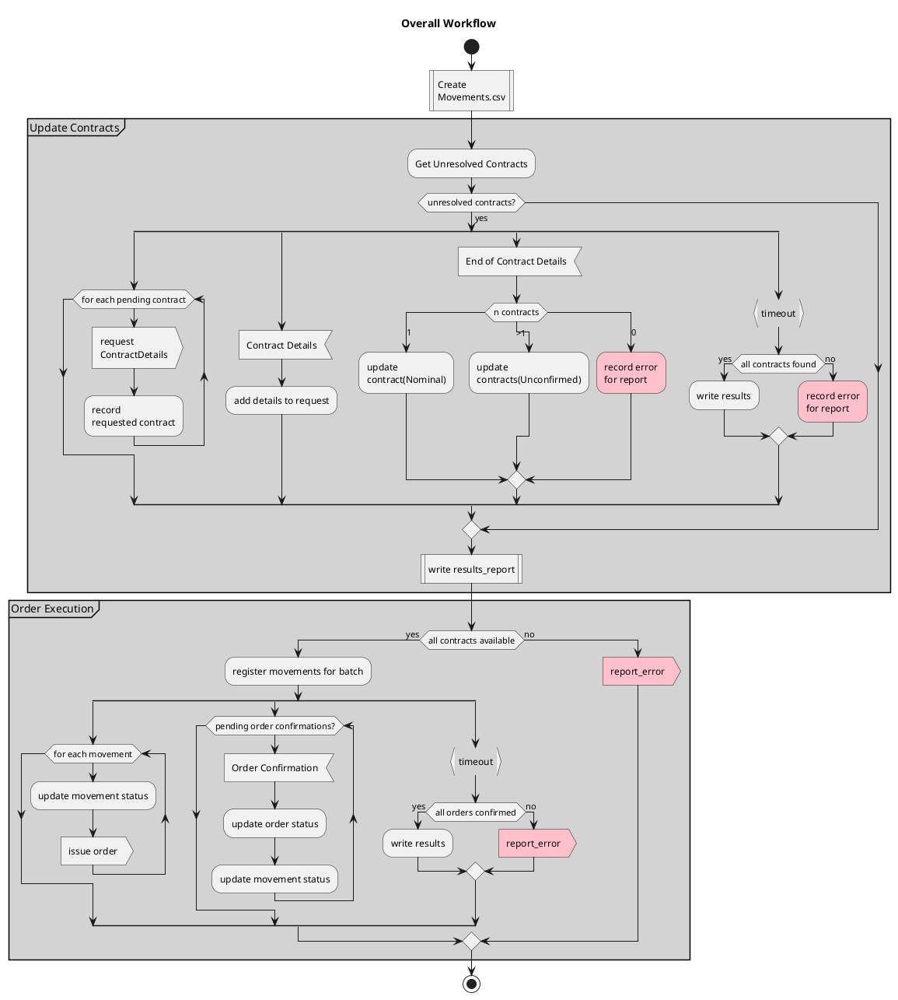

## Overall Workflow

```plantuml
@startuml (id=OVERALL)


title
Overall Workflow
end title

start
:Create\nMovements.csv|
partition #lightGrey "Update Contracts" {
  :Get Unresolved Contracts;
  if (unresolved contracts?) then (yes)
    split
      while (for each pending contract)
        :request\nContractDetails>
        :record\nrequested contract;
      endwhile
    split again
      :Contract Details<
      :add details to request;
    split again
       :End of Contract Details<
       switch (n contracts)
         case (1)
           :update\ncontract(Nominal);
         case (>1)
           :update\ncontracts(Unconfirmed);
         case (0)
           #pink:record error\nfor report;
       endswitch
    split again
       :timeout}
       if (all contracts found) then (yes)
         :write results;
       else (no)
         #pink:record error\nfor report;
       endif      
    end split
  endif
  :write results_report|
}

partition #lightGrey "Order Execution" {
  if (all contracts available) then (yes)
      :register movements for batch;
    split
      while (for each movement)
        :update movement status;
        :issue order>
      endwhile
     split again
       while (pending order confirmations?)
         :Order Confirmation<
         :update order status;
         :update movement status;
       endwhile
     split again
       :timeout}
       if (all orders confirmed) then (yes)
         :write results;
       else (no)
         #pink:report_error>
       endif
     end split
  else (no)
    #pink:report_error>
  endif
}
stop


@enduml
```
